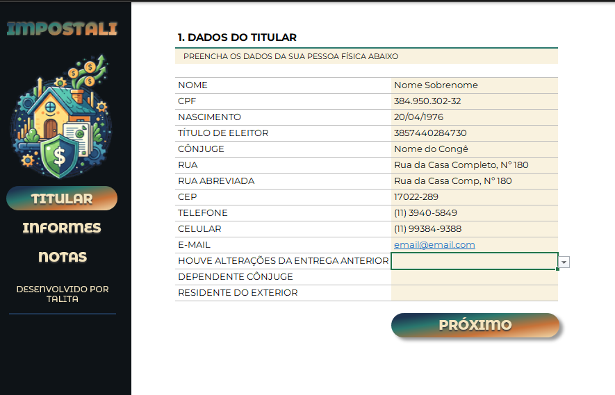
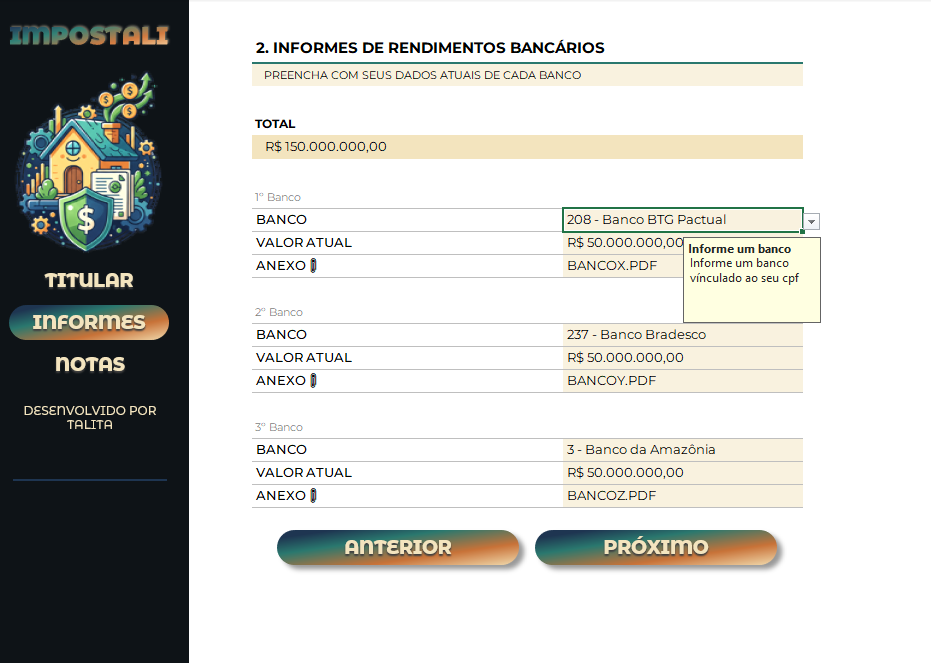
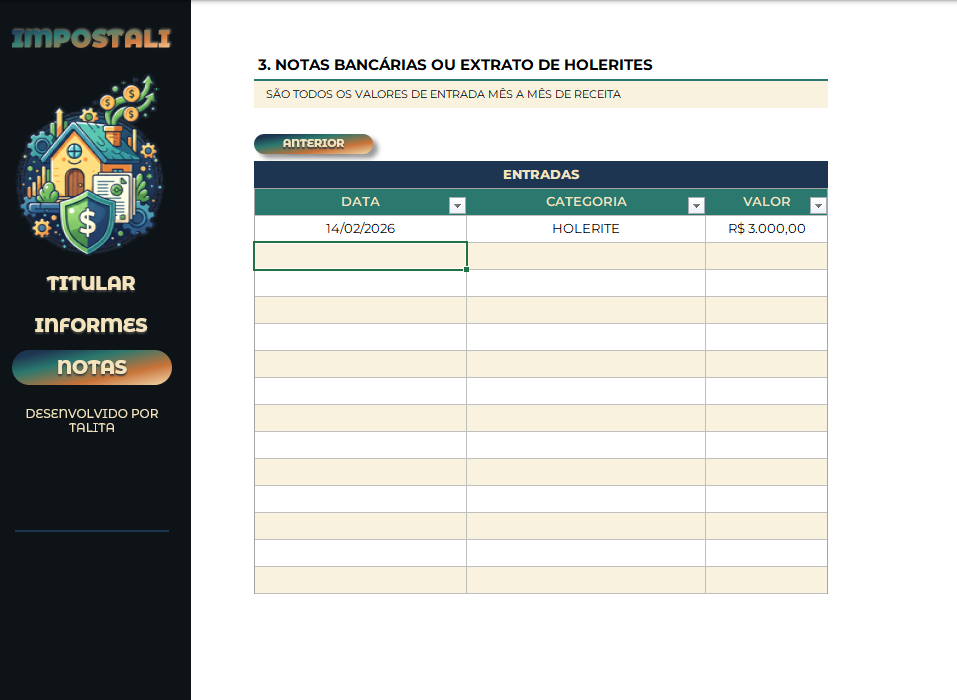

# 📊 Ferramenta de Organização para Imposto de Renda

Projeto criado como parte do **Santander - Excel com Inteligência Artificial - 2º Semestre**, ministrado pelo **DIO**.  
O objetivo é desenvolver uma ferramenta no **Excel** que ajude a organizar e reunir informações essenciais para a declaração de imposto de renda, com interface amigável e funcionalidades práticas.

---

## 🚀 Funcionalidades
- Menus de navegação no Excel  
- Validações automáticas para entradas  
- Links rápidos para acesso facilitado  
- Interface simples e intuitiva  

---

## 🎯 Objetivos de Aprendizagem
- Aplicar conceitos aprendidos em aula em um ambiente prático  
- Documentar processos técnicos de forma clara e estruturada  
- Utilizar o GitHub como ferramenta de compartilhamento de documentação  

---

## 🛠️ Como usar
1. Baixe o arquivo Excel na pasta `/excel`.  
2. Abra no **Microsoft Excel**.  
3. Utilize os menus e validações para organizar suas informações de imposto de renda.  

---

## 📸 Capturas de Tela
Aqui estão alguns exemplos da ferramenta em funcionamento:

  
  
  

---

## 📚 Recursos utilizados
- Microsoft Excel  
- GitHub Markdown  
- Documentações oficiais da DIO e GitHub  

---

## 👩‍💻 Autor
Desenvolvido por **Talita** como parte do desafio da DIO 🚀
